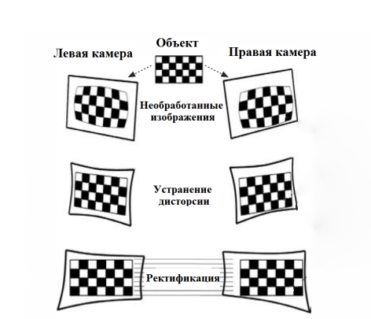

# Калибровка
Калибровка - процесс получения внутрих и внешних параметров камер.
Мы используем следующее...
## Матрица внутренних параметров для каждой камеры
\[
\mathbf{K} = 
\begin{bmatrix}
f_x & 0   & c_x \\
0   & f_y & c_y \\
0   & 0   & 1
\end{bmatrix}
\]
fx - фокусное расстояние по оси X (в пикселях)

fy - фокусное расстояние по оси Y (в пикселях)

cx - координата главной точки (оптического центра) по X

cy - координата главной точки по Y

## Коэффициенты искажения объективов (distortion)
\[
\mathbf{D} = 
\begin{bmatrix}
k_1 & k_2 & p_1 & p_2 & k_3
\end{bmatrix}
\]

k1...k3 - радиальные искажения (рыбий глаз, "подушка")

p1, p2 - тангенциальные искажения (сдвиг изображения при наклоне линзы)

## Матрица поворота
Описывает, как правая камера ориентирована относительно левой.
\[
\mathbf{R} =
\begin{bmatrix}
r_{11} & r_{12} & r_{13} \\
r_{21} & r_{22} & r_{23} \\
r_{31} & r_{32} & r_{33}
\end{bmatrix}
\]

## Вектор трансляции
Положение правой камеры относительно левой в 3D-пространстве

\[
\mathbf{T} =
\begin{bmatrix}
t_x \\
t_y \\
t_z
\end{bmatrix}
\]

## Ректификация
Из-за разницы в положении и ориентации левой и правой камеры, одна и та же точка в пространстве может иметь разные координаты по вертикали.
Нам же нужно, чтобы пиксели на обоих кадрах находились на одной и той же горизонтальной линии, поэтому, засчет полученных параметров мы также расчитываем набор параметров для ректификации, чтобы в дальнейшем составить карты трансформации самого изображения



## Получение параметров
Скрипт `3_calibrate_cameras.py` предназначен для расчета выше описанных параметров.
После выполнения этого сценария в рабочей директории появится три файла:

`calib.npz` - файл калибровки

`rectify.npz` - файл ректификации

`transformation_map.npz` -  карты трансформации

```
usage: 3_calibrate_cameras.py [-h] folder_path rows columns square_size

Этот скрипт предназначен для вычисления внешних и внутренних параметров камер На выходе в корневую директорию будет записано три   
файла calib.npz - результат самой калибровки rectify.npz - результат стерео-ректификации, используются для построения карт
ремаппинга transformation_map.npz - карты трансформации (ремапинга)

positional arguments:
  folder_path  Путь к папке с изображениями
  rows         Количество внутренних углов в строках шахматной доски.
  columns      Количество внутренних углов в столбцах шахматной доски.
  square_size  Размер квадрата в см.

options:
  -h, --help   show this help message and exit
```
