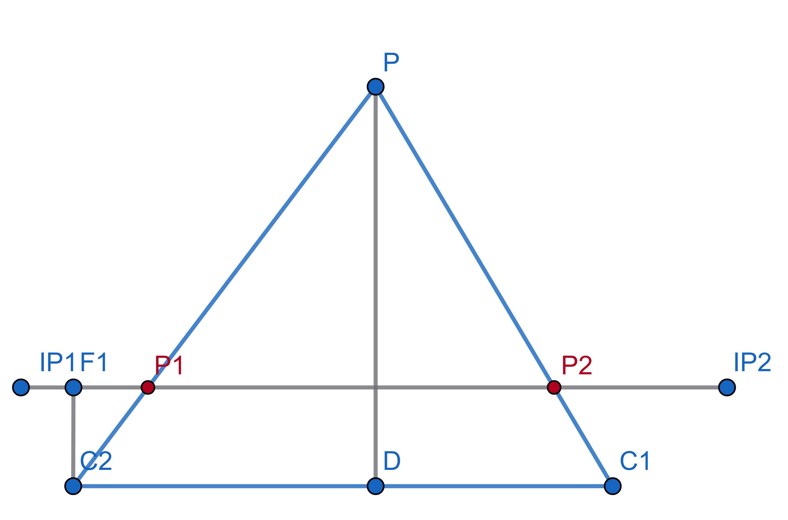
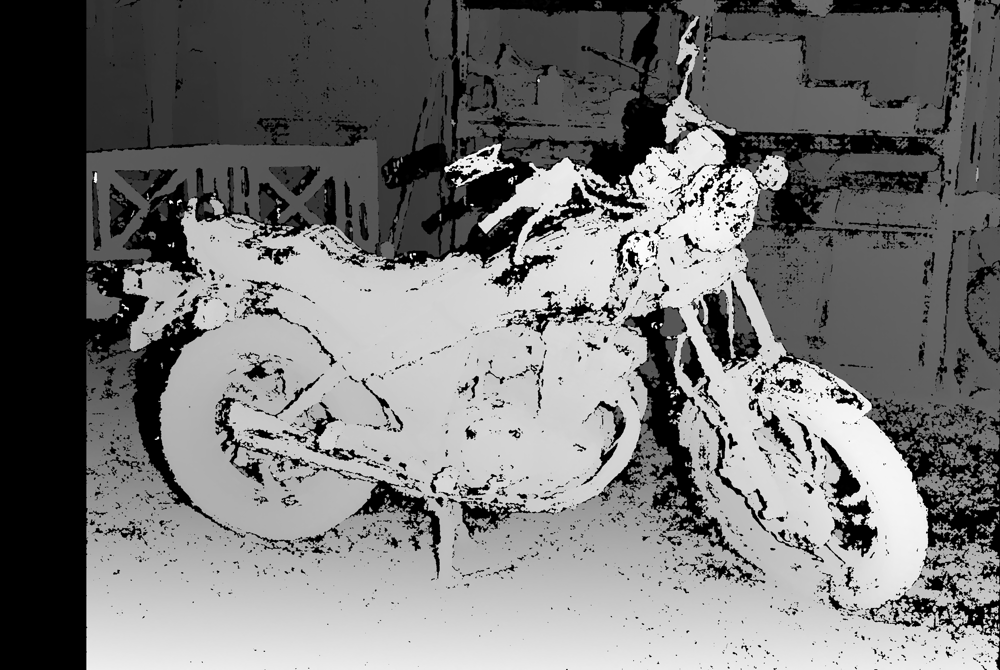
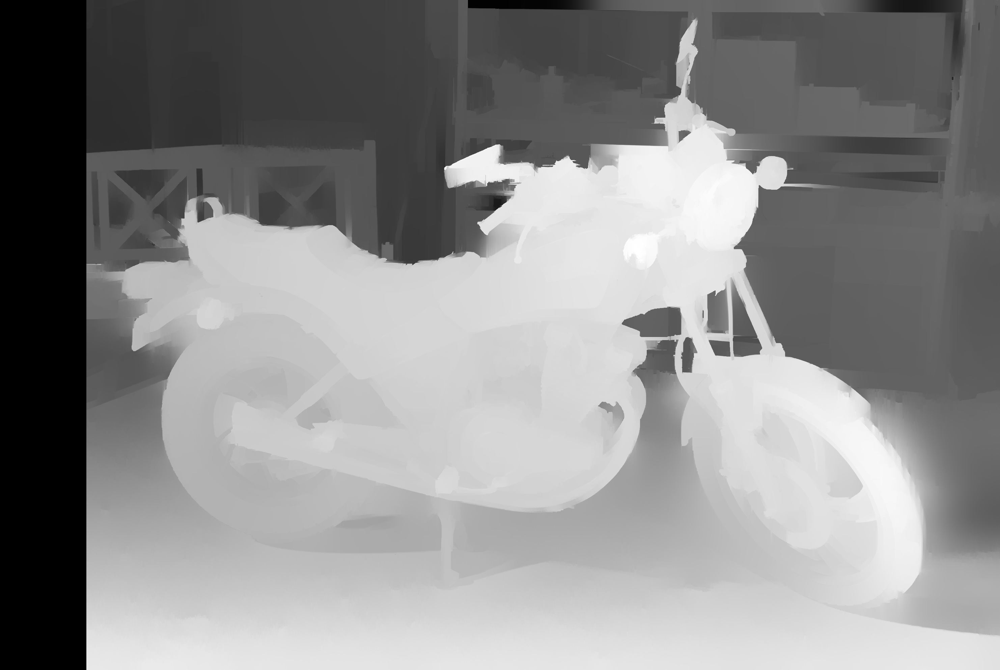

# Карта диспаратности
## Что такое диспаратность
Мы получили пару ректифицированных изображений.

Представим нашу ситуацию в геометрическом виде.



`C1` И `C2` - центры камер.

__Точки__  `IP1` и `IP2` - плоскости изображений (image plane)

`P` - наблюдаемая точка

`P1` И `P2` - перспективные проекции на соответсвующую плоскость

Диспаратностью для точки P будет называться смещение в пикселях точки `P2` относительно точки `P1`:
\[
d = x_{P_1} - x_{P_2}
\]

## Зачем это нужно?
С помощью диспаратности мы можем определить расстояние до точки в реальном мире (глубину).
Пусть `f` - длина отрезка `C2F1` или фокусное расстояние, `b` - длина отрезка `C1C2` или расстояние между камерами, тогда
\[
Z = \frac{f \cdot b}{d}
\]

## Построение карты диспаратности
Карта диспаратности - это матрица, где каждый элемент показывает соответсвие между пикселем базового (чаще всего левого) изображения и пикселем парного.
Это довольно сложная вычислительная задача.

Для получения такой карты будет использоваться алгоритм __`Semi-Global Block Matching`__

Простыми словами, алгоритм делит наше изображение на маленькие участки пикселей (блоки) и по эпиполярным линиям ищет похожие блоки на парном изображении.
Для каждого блока оценивается "стоимость", чем меньше блок с базового изображения отличается от блока с найденного, тем лучше.
Главной особеностью алгоритма SGBM является учитывание не только одного блока локально, а также соседних блоков (это и называется semi-global)

Параметры для SGBM описаны в файле `sgbm_config.yml`
```
min_disparity: 0
num_disparities: 256         # Должно быть кратно 16
block_size: 5                # Нечётное число
disp_12_max_diff: 1
pre_filter_cap: 63
uniqueness_ratio: 15
speckle_window_size: 0
speckle_range: 2
```

Большое влияние на результат будут оказывать первые три параметра:

`min_disparity` - минимальное смещение, с которого начинается поиск

`num_disparities` - максимальный диапазон поиска смещений

`block_size` - размер одного блока


Для сохранения карты диспаратности используется скрипт `4_save_disparity.py`

```
usage: 4_save_disparity.py [-h] cams cams output

Этот скрипт предназначен для показа и сохранения карты диспаратности. Чтобы сохранить карту, в терминале нажмите S. Помимо карты в
папку сохраняются исходные кадры с камер. Это необходимо для дальнейшего наложения цветом на облако точек. Поддерживает сохранение
нескольких карт диспаратности.

positional arguments:
  cams        Индексы камер
  output      Путь к папке, в которую будет сохранена карта диспаратности

options:
  -h, --help  show this help message and exit
```

Перед сохранением к полученной карте применяется пост-обработка

До пост-обработки:


После:

