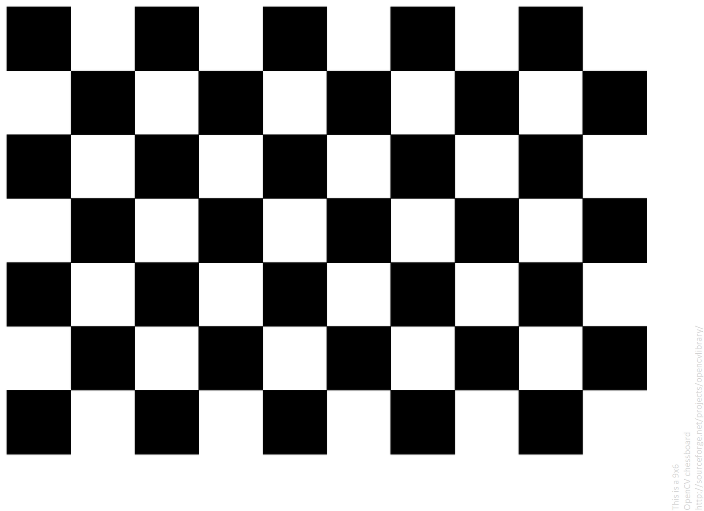
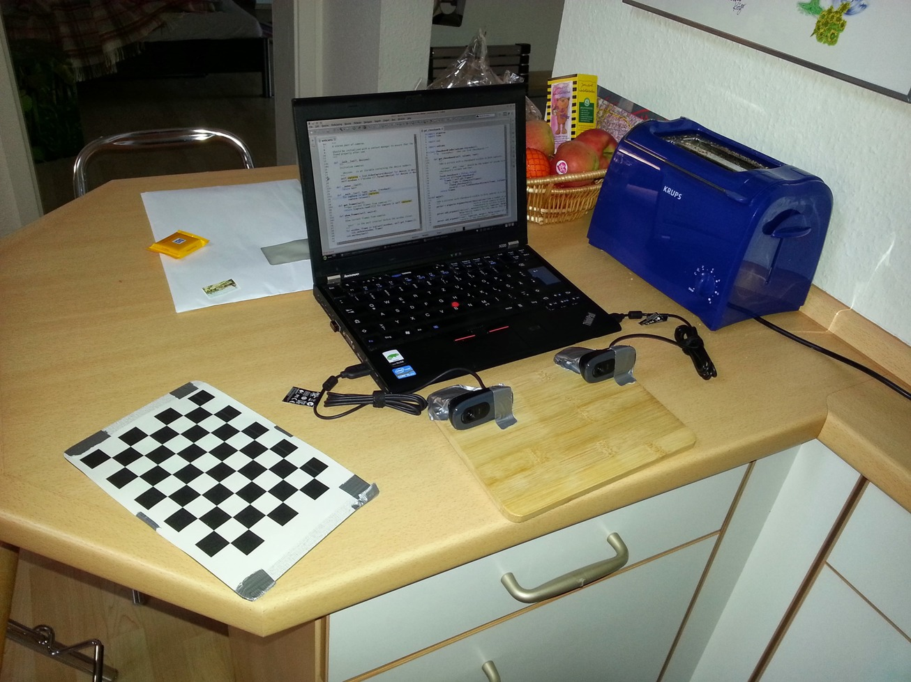

# Начало работы
## Создание стереокамеры
### Что вам понадобится?
Самое главное - удерживать камеры в одинаковом положении при съемке.
Мною использовались две одинаковые камеры __Logitech C270__, но это вовсе необязательно.

Также вам нужна какая-нибудь __жесткая, плоская поверхность__.
### Установка
<small>процесс создания стереокамеры необязательно должен быть таким, как описано ниже.</small>

Для примера, за поверхность возьмем деревянную доску.
Нам нужно, чтобы камеры не двигались, поэтому не будет лишним их приклеить.


Для большей уверенности можно замотать их с двух сторон скотчем.


### Подготовка шахматной доски
Для калибровки камер по шаблону мною используется шахматная доска.
Вы можете распечатать ее на бумажном листе и также приклеить на какую-нибудь __жесткую и плоскую поверхность__



### Подключение к компьютеру
После подключения камер к компьютеру вся установка должна выглядеть как-то так:

<small>все изображения выше взяты с [этой](https://erget.wordpress.com/2014/02/01/calibrating-a-stereo-camera-with-opencv/) статьи.</small>

Чтобы вывести изображения с камер вы можете запустить скрипт `0_show_cameras.py`.
В аргументы командной строки необходимо передать индексы камер.
Чаще всего, если к вашему компьютеру не было подключено камер, нужными индексами будут `0` и `1`.
Если же вы используете ноутбук со встроенной камерой, то можете попробовать `1` и `2`.

Запустим скрипт
```bash
python 0_show_cameras.py 1 2
```
Для каждого скрипта вы можете использовать аргумент `--help`:
```bash
>>> python 0_show_cameras.py --help

usage: 0_show_cameras.py [-h] cams cams

Этот скрипт предназначен для показа видеопотока с камер

positional arguments:
  cams        Индексы камер

options:
  -h, --help  show this help message and exit
```


## Сборка изображений для калибровки

Для сборки изображений с шаблоном используется скрипт `1_capture_chessboard.py`.
Кадры с камер записываются каждые 5 секунд. перед первым захватом также проходит 5 секунд.
```bash
python 1_capture_chessboard.py 1 2 30 dataset 9 6  
```
Разберем каждый параметр:

`1 2` - индексы камер

`30` - количество снимков

`dataset` - папка, в которую записываются кадры

`9 6` размер нашей доски (9x6 углов)

Перед съемкой рекомендуется настроить освещение.
При съемке не стоит резко трясти шаблоном.
Используйте разные наклоны и перемещайте доску по видимой области двух камер.


```bash
usage: 1_capture_chessboard.py [-h] cams cams amount output rows columns

Этот скрипт предназначен для захвата шахматной доски. Захват шахматной доски необходим для калибровки по шаблону. Рекомендуется    
сделать как минимум 30 снимков.

positional arguments:
  cams        Индексы камер
  amount      Количество снимков
  output      Папка, в которую сохраняются кадры
  rows        Количество внутренних углов в строках шахматной доски.
  columns     Количество внутренних углов в столбцах шахматной доски.

options:
  -h, --help  show this help message and exit
```
